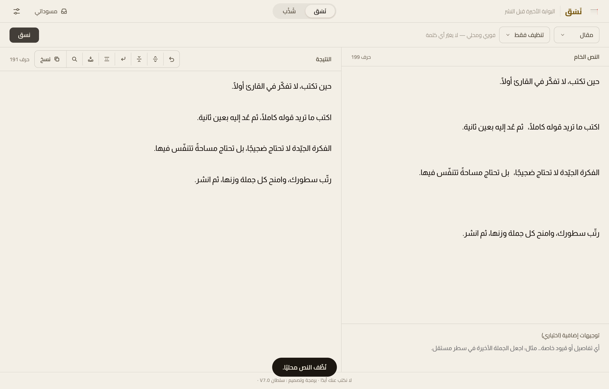
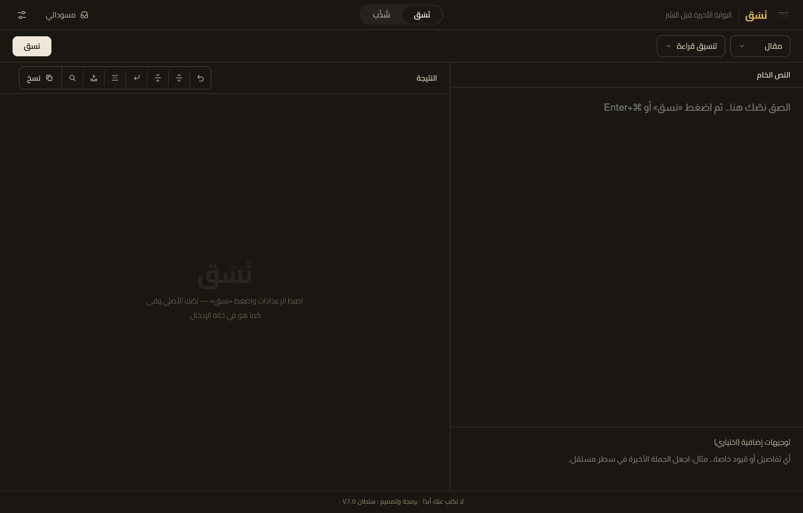
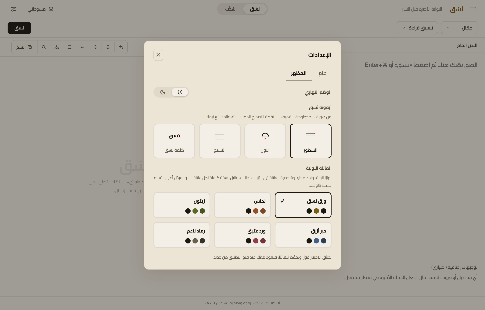
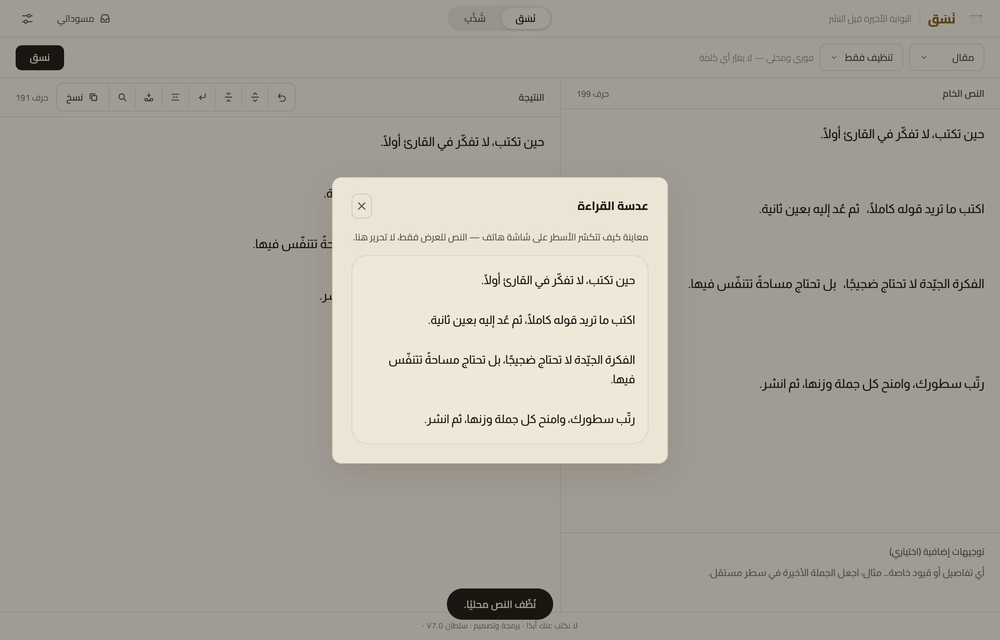

<div align="center">

<picture>
  <source media="(prefers-color-scheme: dark)" srcset="assets/readme/wordmark-dark.svg">
  
</picture>

### البوابة الأخيرة قبل النشر

تطبيق مكتبي عربي لتنسيق النصوص وتهيئتها للقراءة والنشر —<br>
يرتّب الشكل والإيقاع، ولا يكتب عنك أبدًا.

<p>
  
  
  
  
</p>

</div>


## نَسَق

نَسَق أداة هادئة تقف بين نصّك وزرّ النشر. تأخذ ما كتبته وتعيده إليك مرتّبًا: الفقرات، والمسافات، وكسر الأسطر، والأسطر المفردة، وإيقاع القراءة — دون أن تلمس كلماتك أو تبدّل صوتك.

عهد واحد يحكم التطبيق كلّه: **لا نكتب عنك أبدًا.**

## لماذا نَسَق؟

النص الجيّد قد يصل مكتظًّا. جُمَل متلاصقة، وفقرات بلا نَفَس، وسطور طويلة تُتعب العين على الشاشة. المعنى موجود، لكن الشكل يخذله.

نَسَق يعالج هذا الشكل وحده: يمنح النص مساحته، ويكشف إيقاعه، ويُريك كيف سيبدو للقارئ قبل أن تنشره — من غير أن يعيد صياغته.

## ماذا يفعل؟

- **خمسة أنماط للنص** — مقال، منشور، شذرة، رسالة، مخطط.
- **مستويات تدخّل متدرّجة** — من «تنظيف فقط» (محلي بالكامل، بلا اتصال) إلى تنسيق القراءة، فالتنسيق الإيقاعي، فتجهيز النص للنشر.
- **تنسيق حسب المنصة** — سابستاك (مقالًا ونوتًا)، وإكس، وثريدز، وإنستغرام، وواتساب؛ مع تنبيه لحدود الأحرف حيث تفرضها المنصة.
- **أدوات ضبط محلية على النتيجة** — سطور أكثر أو أقل، وفصل الجمل، وحذف الأسطر الفارغة، وتراجع حتى عشرين خطوة.
- **بصمة الإيقاع** — وصف محايد لتنفّس النص بعد التنسيق الإيقاعي.
- **تنويعات** — ثلاث صيغ تختلف في مواضع كسر السطر لوجهة سابستاك، تختار أنقاها.
- **مسودات محلية** — تحفظ النص الأصلي والنتيجة معًا على جهازك، مع بحث ونسخة احتياطية (دمجًا لا استبدالًا).

## ما الذي لا يفعله؟

- **لا يكتب النص بدلًا عنك** — لا جُمَل من عنده، ولا أفكار مُضافة.
- **لا يغيّر صوت الكاتب** — الكلمات والمعنى كما تركتَهما.
- **لا يحاكم جودة نصّك** — لا درجات، ولا نصائح تحريرية.
- **لا يحوّل التنسيق إلى تحرير** — عمله شكل النص، لا مضمونه.

## عرض بصري



النص الخام يمينًا، والنتيجة يسارًا. في اللقطة مستوى **«تنظيف فقط»** — يعمل محليًا بالكامل بلا أي اتصال: يُزيل الأسطر الفارغة والمسافات الزائدة، ولا يمسّ كلمة.

## أنماط التنسيق وتجربة القراءة

تختار النمط والمستوى، فيتكفّل نَسَق بالباقي: أين يبدأ السطر، ومتى يتنفّس النص بفراغ، وكيف تتوزّع الوقفات. الهدف واحد — أن يصل النص إلى القارئ كما تسمعه أنت في رأسك.



### المظهر

المظهر يتبع نظامك تلقائيًا (نهارًا وليلًا)، ويمكنك تثبيته يدويًا. ولك ستّ عائلات لونية — ورق نَسَق، ونحاس، وزيتون، وحبر أزرق، وورد عتيق، ورماد ناعم — لكلٍّ نهارُها وليلُها. وأربع أيقونات من هوية «المخطوطة الرقمية»، تحمل جميعها نقطة التصحيح الحمراء الثابتة.



## عدسة القراءة

قبل أن تنشر، تُريك عدسة القراءة نصّك بعرض شاشة هاتف — كيف تتكسّر أسطره فعلًا حين يقرؤه أحدهم على جوّاله. معاينة للعرض فقط، لا تحرير.



## شَذْب — وظيفة داخل نَسَق

إلى جانب التنسيق، يضمّ نَسَق وظيفة **شَذْب**: أداة لضغط النصوص القصيرة وتهذيبها بالحذف. تفحص الشذرة، وتقترح قصّات حذف — اقتباسات حرفية من نصّك — تقبل كلًّا منها أو ترفضها، ويشهد تحقّق آلي أن لا كلمة أُضيفت.

شَذْب يحذف ويُكثّف، ويحافظ على صوت النص كما هو. ليس محرّرًا أدبيًّا، ولا يضيف من عنده شيئًا. نَسَق هو المنتج الأساسي، وشَذْب وظيفة مساعدة داخله.

## الخصوصية وحفظ النصوص

- **يعمل محليًا.** لا يُرسَل أيّ نصّ إلى أيّ خدمة إلّا عند ضغطك زرّ التنسيق أو الفحص صراحةً.
- **مستوى «تنظيف فقط» وأدوات الضبط المحلية** تعمل دون أيّ اتصال بالشبكة.
- **مسوّداتك وإعداداتك** تُحفظ على جهازك وحده، ولا تغادره.
- مفتاح الخدمة يُخزَّن محليًا في ملف إعدادات مقفل على جهازك، ولا يظهر في أيّ سجلّ أو رسالة.

## التثبيت والتجربة

نَسَق يُبنى حاليًا من المصدر، ويتطلّب [Node.js](https://nodejs.org) و[بيئة Rust ‏/ Tauri](https://tauri.app).

```sh
# تثبيت الاعتمادات
npm install

# التشغيل أثناء التطوير
npm run tauri dev

# بناء نسخة قابلة للتثبيت (macOS)
npm run tauri build
```

بعد البناء تجد التطبيق في `src-tauri/target/release/bundle/`.

> **قريبًا:** دعوة تجربة بنسخة جاهزة للتثبيت، دون الحاجة إلى بناء من المصدر.

## الإبلاغ عن مشكلة أو إرسال ملاحظة

نَسَق في مرحلة تجربة، وملاحظاتك تصنع النسخة القادمة. حين تبلّغ عن مشكلة، اذكر:

- **وصف المشكلة** — ما الذي حدث، وما الذي توقّعتَه.
- **خطوات تكرارها** — كيف نصل إلى الحالة نفسها.
- **إصدار التطبيق** — تجده في تذييل النافذة (مثال: v7.0).
- **لقطة شاشة** — إن أمكن.

> *قناة استقبال البلاغات ستُعلَن قريبًا. حتى ذلك الحين، احتفظ ببلاغك بالتفاصيل أعلاه.*

## التقنيات

- **[Tauri](https://tauri.app) 2** — إطار تطبيق سطح المكتب.
- **Rust** — النواة الخلفية ومنطق التحقّق.
- **HTML ‏/ CSS ‏/ JavaScript** — الواجهة، دون أُطُر خارجية.
- **Cairo ‏/ Almarai** — خطّا واجهة التطبيق ومتنه، محمّلان محليًا داخل التطبيق: Cairo للعناوين والواجهة، و Almarai للمتن.

يفصل التطبيق معماريًّا بين وضع الويب المؤطَّر (framed) ووضعه المكتبي الأصلي (native)، ولا يخلط بينهما.

## حالة المشروع

خاصّ، وفي مرحلة تجربة محدودة. الإصدار الحالي **v7.0.0** (macOS · Apple Silicon). النشر العام لمرحلة لاحقة.

سجلّ الإصدارات الكامل في **[CHANGELOG.md](CHANGELOG.md)**.

## المطوّر

<div align="center">

<picture>
  <source media="(prefers-color-scheme: dark)" srcset="assets/readme/sultan-signature-dark.png">
  
</picture>

برمجة وتصميم: **سلطان**

<br>
<sub>نَسَق — لا نكتب عنك أبدًا.</sub>

</div>
