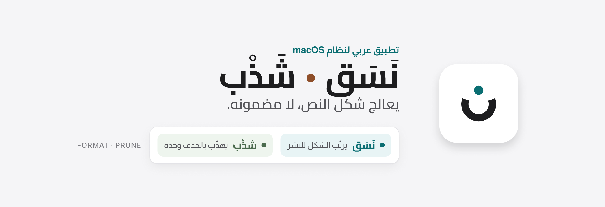
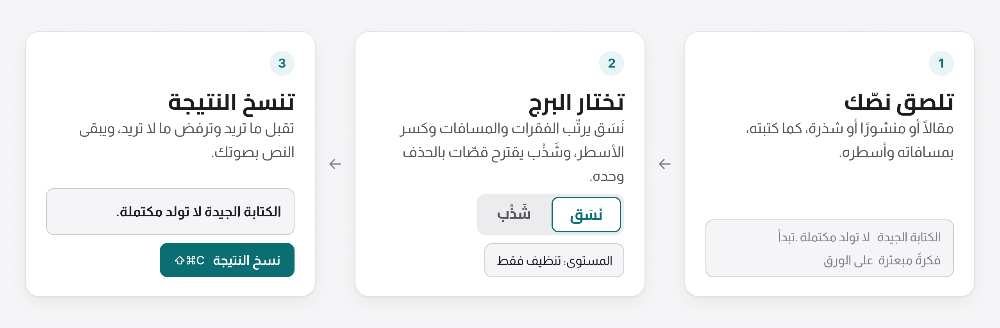

<picture>
  <source media="(prefers-color-scheme: dark)" srcset="assets/readme/header-ar-dark.png">
  
</picture>

### [⬇︎ تنزيل أحدث إصدار](https://github.com/iSltanX/Nasq/releases/latest)

مجاني · macOS · Apple Silicon

[الفكرة](#الفكرة) · [طريقة العمل](#طريقة-العمل) · [الميزات](#الميزات) · [التثبيت](#التثبيت) · [الاستخدام](#الاستخدام) · [لقطات الشاشة](#لقطات-الشاشة) · [الخصوصية](#الخصوصية) · [الأسئلة المتكررة](#الأسئلة-المتكررة)

---

## الفكرة

النص الجيد قد يضيع في شكله: فقرات متلاصقة، ومسافات مرتبكة، وأسطر لا تناسب المنصة التي ستنشر فيها. وأدوات الذكاء الاصطناعي المعتادة لا تكتفي بالشكل، بل تعيد كتابة النص بصوت غير صوتك.

**نَسَق • شَذْب** تطبيق واحد لنظام macOS يعالج شكل النص، لا مضمونه، ويضمّ برجين معزولين:

| البرج | عمله |
| --- | --- |
| **نَسَق** | يرتّب النص للقراءة والنشر: الفقرات، والمسافات، وكسر الأسطر، وإيقاع القراءة. |
| **شَذْب** | يهذّب الشذرة القصيرة بالحذف وحده: يقترح قصّات هي اقتباسات حرفية من نصّك، تقبل كلًّا منها أو ترفضها. |

> **العهد:** لا يكتب النص بدلًا عنك، ولا يغيّر صوتك، ولا يحاكم جودة ما كتبت. عمله الشكل وحده.

---

## طريقة العمل

<picture>
  <source media="(prefers-color-scheme: dark)" srcset="assets/readme/steps-ar-dark.png">
  
</picture>

في شَذْب يشهد تحقّق آليّ أن كل قصّة مقترحة موجودة حرفيًّا في نصّك، وأن لا كلمة أُضيفت إليه.

---

## الميزات

**نَسَق:**

- **خمسة أنماط:** مقال، ومنشور، وشذرة، ورسالة، ومخطط.
- **مستويات تدخّل متدرّجة:** من «تنظيف فقط» على جهازك بلا شبكة، إلى تنسيق القراءة والإيقاع، وتجهيز النص للنشر.
- **تنسيق حسب المنصة:** مقال سابستاك ونوته، وإكس، وثريدز، وإنستغرام، وواتساب.
- **أدوات ضبط محلية على النتيجة:** سطور أقل أو أكثر، وكسر بعد النقطة، وحذف السطور الفارغة أو إضافتها.
- **تنويعات** على النتيجة، و**عدسة قراءة** بعرض شاشة الهاتف.

**شَذْب:**

- قصّات مقترحة **بالحذف وحده**، تقبلها أو ترفضها واحدة واحدة.
- **بطاقة قراءة** للشذرة، وإرسال النتيجة إلى نَسَق بضغطة.

**في البرجين:** مسودات محفوظة على جهازك، ومزوّد تختاره بمفتاحك، ونافذة بهيئة macOS الأصلية من اليمين إلى اليسار، ووضعان فاتح وداكن.

---

## التثبيت

1. نزّل ملف `Nasaq_…_aarch64.dmg` من [صفحة الإصدارات](https://github.com/iSltanX/Nasq/releases/latest).
2. افتحه واسحب **Nasaq** إلى مجلد **التطبيقات**.
3. من **الإعدادات ← المزوّد** اختر مزوّدك وأدخل مفتاحه، أو اختر Ollama على جهازك بلا مفتاح.

> [!IMPORTANT]
> **تنبيه Gatekeeper:** نَسَق موقَّع ذاتيًا لا بشهادة Apple Developer ID، لأنه مشروع شخصي، فيوقفه macOS عند أول فتح. حاول فتحه مرة، ثم افتح **إعدادات النظام ← الخصوصية والأمن** واضغط **افتح على أي حال**. تكفي مرة واحدة.

### المتطلبات

- جهاز Mac بمعالج **Apple Silicon**. الواجهة مصمَّمة على هيئة macOS 27.
- مفتاح من أحد المزوّدين: Gemini، أو OpenAI، أو Claude، أو Groq، أو OpenRouter. أو Ollama مثبّتًا على جهازك.
- مستوى «تنظيف فقط» وأدوات الضبط المحلية تعمل دون مزوّد ودون شبكة.

---

## الاستخدام

| الإجراء | الاختصار |
| --- | --- |
| نسّق، أو افحص الشذرة في شَذْب | <kbd>⌘</kbd><kbd>↩</kbd> |
| نسخ النتيجة | <kbd>⇧</kbd><kbd>⌘</kbd><kbd>C</kbd> |
| أرِني تنويعات | <kbd>⇧</kbd><kbd>⌘</kbd><kbd>↩</kbd> |
| سطور أقل، أو أكثر | <kbd>⌘</kbd><kbd>[</kbd> · <kbd>⌘</kbd><kbd>]</kbd> |
| عدسة القراءة | <kbd>⌥</kbd><kbd>⌘</kbd><kbd>R</kbd> |
| تصدير لسابستاك | <kbd>⌥</kbd><kbd>⌘</kbd><kbd>C</kbd> |
| احذف القصّة، أو أبقِها (شَذْب) | <kbd>⌘</kbd><kbd>⌫</kbd> · <kbd>⌘</kbd><kbd>K</kbd> |
| أرسل إلى نَسَق (شَذْب) | <kbd>⌥</kbd><kbd>⌘</kbd><kbd>N</kbd> |
| البرج: نَسَق، أو شَذْب | <kbd>⌘</kbd><kbd>1</kbd> · <kbd>⌘</kbd><kbd>2</kbd> |
| حفظ في المسودات · جلسة جديدة | <kbd>⌘</kbd><kbd>S</kbd> · <kbd>⌘</kbd><kbd>N</kbd> |
| الإعدادات | <kbd>⌘</kbd><kbd>,</kbd> |

- لكل أمر مكانه في شريط القوائم بعناوين عربية، وقائمته الرابعة تتبدّل مع البرج.
- التحديثات من القائمة: **التحقق من وجود تحديثات…**، أو من تبويب **التحديثات** في الإعدادات.

---

## لقطات الشاشة

<picture>
  <source media="(prefers-color-scheme: dark)" srcset="assets/readme/nasaq-dark.png">
  
</picture>
نَسَق: الأصل يمينًا، والنتيجة يسارًا مع أدوات الضبط.

<table>
  <tr>
    <td width="62%" align="center" valign="top">
      <picture>
        <source media="(prefers-color-scheme: dark)" srcset="assets/readme/shadhb-dark.png">
        
      </picture> 
      <b>شَذْب</b> 
      الشذرة، ولوح الفحص بالقصّات المقترحة.
    </td>
    <td width="38%" align="center" valign="top">
      <picture>
        <source media="(prefers-color-scheme: dark)" srcset="assets/readme/settings-dark.png">
        
      </picture> 
      <b>الإعدادات</b> 
      المزوّد والنموذج، والمفتاح في سلسلة المفاتيح.
    </td>
  </tr>
</table>

---

## الخصوصية

- **لا يغادر نصّك الجهاز إلا حين تطلب:** حين تضغط «نسّق» أو «افحص الشذرة»، يُرسَل النص إلى المزوّد الذي اخترته أنت، ولا يمرّ بأي خادم آخر.
- **ما يعمل محليًا بالكامل:** مستوى «تنظيف فقط»، وأدوات الضبط على النتيجة، والمسودات، والإعدادات. ومع Ollama يبقى كل شيء على جهازك.
- **المفتاح في سلسلة مفاتيح macOS،** لا في ملف.
- **لا حساب، ولا تحليلات، ولا تتبّع.** والاتصال الآخر الوحيد هو التحقق من التحديثات، ويمكن إيقافه.

---

## الأسئلة المتكررة

<strong>هل يعيد كتابة نصّي؟</strong>
 

لا. نَسَق يغيّر الشكل وحده: الفقرات والمسافات وكسر الأسطر. وشَذْب لا يضيف كلمة أبدًا، بل يقترح حذفًا من نصّك نفسه، ويتحقق آليًا من ذلك قبل أن يعرضه عليك.

<strong>ما الفرق بين نَسَق وشَذْب؟</strong>
 

نَسَق للنصوص التي تريد نشرها: يرتّبها للقراءة وللمنصة. وشَذْب للشذرة القصيرة التي تريد إحكامها: يقترح ما يمكن حذفه دون أن يقتل نبرتها. البرجان معزولان، ولكلٍّ منهما عقده وحدوده.

<strong>هل يعمل بلا إنترنت؟</strong>
 

جزئيًا: مستوى «تنظيف فقط» وأدوات الضبط المحلية تعمل بلا شبكة. وبقية المستويات تحتاج مزوّدًا، فإن أردته بلا إنترنت فاختر Ollama على جهازك.

<strong>لماذا يسألني macOS عن سلسلة المفاتيح بعد التحديث؟</strong>
 

لأن التطبيق موقَّع ذاتيًا، فيعدّ macOS كل تحديث تطبيقًا جديدًا يطلب الوصول إلى المفتاح المحفوظ. وافق مرة واحدة بعد كل تحديث.

<strong>هل التحديثات آمنة؟</strong>
 

كل تحديث موقَّع بمفتاح نَسَق، ويتحقق التطبيق من توقيعه قبل تثبيته، ولا يُنزَّل شيء قبل موافقتك.

<strong>هل يعمل على معالجات Intel؟</strong>
 

لا. الإصدارات مبنية لـ Apple Silicon فقط.

<strong>كيف أزيله تمامًا؟</strong>
 

1. احذف **Nasaq** من مجلد التطبيقات.
2. احذف مجلد الإعدادات والمسودات: `~/Library/Application Support/com.nasaq.app/`
3. من تطبيق **Keychain Access** احذف المفتاح المحفوظ باسم `com.nasaq.app`.

---

## للمطوّرين

<b>البناء من المصدر</b>
 

**المتطلبات:** Node.js، وRust، وأدوات سطر أوامر Xcode.

| الأمر | ما يفعله |
| --- | --- |
| `npm install` | يثبّت الاعتماديات |
| `npm run tauri dev` | تشغيل تطويري |
| `npm test` | اختبارات الواجهة والمنطق |
| `cargo test --manifest-path src-tauri/Cargo.toml` | اختبارات النواة |
| `npm run tauri build -- --config '{"bundle":{"createUpdaterArtifacts":false}}'` | يبني التطبيق وملف DMG دون أصول المُحدِّث الموقَّعة |

**عزل البرجين:** لا تُدمج برومبتات نَسَق وشَذْب ولا عقودهما ولا منطق مخرجاتهما، ولا استيراد بين `nasaq/` و`shadhb/`. المشترك الحقيقي وحده يعيش في `shared/`، ويحرس القاعدة `tests/isolation.test.js`.

مبني بـ Tauri 2 وRust، بواجهة HTML وCSS وJavaScript بلا أُطُر، وخطَّي Almarai وCairo محمّلين محليًا. رموز التصميم وأيقوناته مولَّدة من ملف التصميم بأدوات `tools/`. سجل الإصدارات في [CHANGELOG.md](CHANGELOG.md).

## الرخصة

جميع الحقوق محفوظة لسلطان. لا رخصة مفتوحة المصدر معلنة لهذا المستودع.

---

**تصميم وتطوير: سلطان** · Designed & developed by Sultan

الموقع: [bysltan.com](https://www.bysltan.com)

من الصانع نفسه 
تطبيقات macOS: [بدّل](https://github.com/iSltanX/Baddel) · [رفّ](https://github.com/iSltanX/Raff) · [Luma](https://github.com/iSltanX/Luma) · [نفّذ](https://github.com/iSltanX/naffith) 
إضافات المتصفح: [SnRead](https://github.com/iSltanX/SnRead) · [صَوْب](https://github.com/iSltanX/SAWB) · [جسور](https://github.com/iSltanX/Jusoor)

[سجل الإصدارات](CHANGELOG.md) · [الإصدارات](https://github.com/iSltanX/Nasq/releases)

