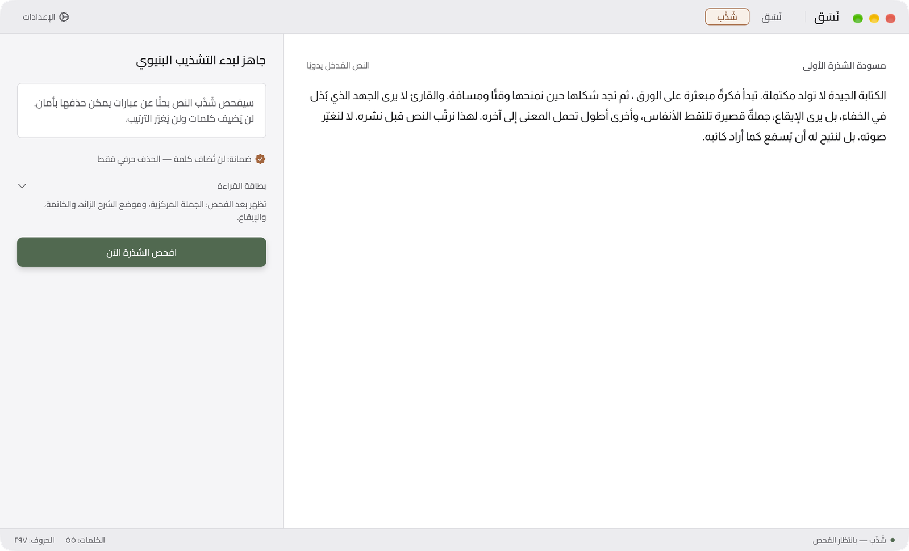
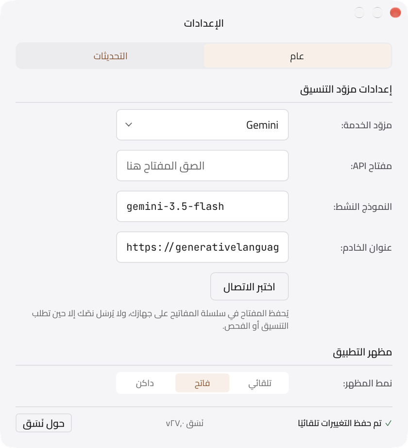

<div align="center">


# نَسَق • شَذْب

تطبيق مكتبي عربيّ لـ macOS يعالج شكل النص، لا مضمونه.

</div>

<p align="center">
  <picture>
    <source media="(prefers-color-scheme: dark)" srcset="assets/readme/nasaq-dark.png">
    
  </picture>
</p>

## ما هو

تطبيق واحد يضمّ برجين معزولين، لكلٍّ عمله وحدوده:

- **نَسَق — التنسيق.** يرتّب النص للقراءة والنشر: الفقرات، والمسافات، وكسر الأسطر، وإيقاع القراءة. خمسة أنماط نصّية، ومستويات تدخّل متدرّجة من «تنظيف فقط» المحلي بالكامل إلى تجهيز النص للنشر، وتنسيق حسب المنصّة، وأدوات ضبط محلية على النتيجة، وتنويعات، وعدسة قراءة بعرض شاشة الهاتف، ومسودات على الجهاز.
- **شَذْب — التهذيب بالحذف.** يضغط الشذرات بالحذف وحده: يقترح قصّات هي اقتباسات حرفية من النص، تقبل كلًّا منها أو ترفضها، ويشهد تحقّق آليّ أن لا كلمة أُضيفت.

<p align="center">
  <picture>
    <source media="(prefers-color-scheme: dark)" srcset="assets/readme/shadhb-dark.png">
    
  </picture>
</p>

**العهد:** لا يكتب النص بدلًا عنك، ولا يغيّر صوتك، ولا يحاكم جودة ما كتبت. عمله الشكل وحده.

**الخصوصية:** لا يغادر نصّك الجهاز إلا حين تضغط «نسّق» أو «افحص» صراحةً. مستوى «تنظيف فقط» وأدوات الضبط المحلية تعمل بلا شبكة، والمسودات والإعدادات تبقى على جهازك، ومفتاح المزوّد محفوظ في سلسلة مفاتيح macOS لا في ملف.

**المزوّدون:** Gemini وOpenAI وClaude وGroq وOpenRouter بمفتاحك، أو Ollama على جهازك بلا مفتاح.

<p align="center">
  <picture>
    <source media="(prefers-color-scheme: dark)" srcset="assets/readme/settings-dark.png">
    
  </picture>
</p>

## عزل البرجين

البرجان معزولان عمدًا: لا تُدمج برومبتاتهما ولا عقودهما ولا منطق مخرجاتهما، ولا استيراد بين `nasaq/` و`shadhb/`، ولا ينتقل ثابت من أحدهما إلى الآخر ولو تطابق حرفيًا. المشترك الحقيقي وحده — نقل خام للمزوّد، وتخزين محلي، وحافظة — يعيش في `shared/`. يحرس هذه القاعدة `tests/isolation.test.js`، ويجب أن يبقى أخضر بعد أي تعديل. التفصيل في [`CLAUDE.md`](CLAUDE.md).

## التثبيت

نزّل أحدث نسخة من **[صفحة الإصدارات](https://github.com/iSltanX/Nasq/releases/latest)** (‏`.dmg` لأجهزة Mac بمعالج Apple)، ثم اسحب `Nasaq.app` إلى مجلد التطبيقات.

**أول فتح:** التطبيق موقَّع توقيعًا محليًا (ad-hoc) لا بشهادة Apple Developer ID، فيوقفه Gatekeeper عند أول فتح. افتحه مرة، ثم اضغط «فتح على أي حال» في «إعدادات النظام ← الخصوصية والأمن». وللسبب نفسه قد يسألك macOS بعد كل تحديث، مرةً واحدة، عن إذن الوصول إلى المفتاح المحفوظ في سلسلة المفاتيح.

## التحديثات

يحمل التطبيق مُحدِّثًا داخليًا: «التحقق من وجود تحديثات…» في قائمة التطبيق، أو تبويب «التحديثات» في الإعدادات حيث يمكن إيقاف التحقق التلقائي. لا يُنزَّل تحديث قبل موافقتك، وكل تحديث موقَّع بمفتاح نَسَق ويتحقّق التطبيق من توقيعه قبل تثبيته. الإصدارات وملف `latest.json` في [صفحة الإصدارات](https://github.com/iSltanX/Nasq/releases).

## حالة المشروع

النسخة الحالية `27.0.0`، إصدار الإطلاق: أُعيد بناء الواجهة كاملةً من ملف التصميم على هيئة macOS 27، ثم فُحص التطبيق كله في ثماني مراحل (m1–m8). التصميم هو المرجع والكود يتبعه.

- **[`STATUS.md`](STATUS.md)** — أين وصل العمل، والخطوة التالية.
- **[`docs/PHASES.md`](docs/PHASES.md)** — مراحل البناء وأهدافها ومعايير اكتمالها.
- **[`AUDIT-STATUS.md`](AUDIT-STATUS.md)** — حصيلة جولة الفحص m1–m8.
- **[`CHANGELOG.md`](CHANGELOG.md)** — سجلّ الإصدارات حتى `27.0.0`.

## التطوير

يتطلّب البناء [Node.js](https://nodejs.org) و[بيئة Rust ‏/ Tauri](https://tauri.app).

```sh
npm install          # الاعتمادات
npm run tauri dev    # التشغيل أثناء التطوير
npm test             # اختبارات الواجهة والمنطق
npm run tauri build -- --config '{"bundle":{"createUpdaterArtifacts":false}}'  # بناء نسخة قابلة للتثبيت
```

ولاختبارات النواة: `cargo test` داخل `src-tauri`.

بعد البناء تجد التطبيق والـ`.dmg` في `src-tauri/target/release/bundle/`. أما أصول المُحدِّث الموقَّعة فلا تُبنى إلا بمفتاح التوقيع الخاص (`TAURI_SIGNING_PRIVATE_KEY`)، وهو خارج المستودع؛ لذلك يعطّلها الأمر أعلاه، ومن دونه يتوقّف البناء عند خطوة التوقيع.

## التقنيات

- **[Tauri](https://tauri.app) 2** — إطار سطح المكتب، ونافذة بهيئة macOS أصلية.
- **Rust** — النواة الخلفية، وعقود البرجين، ومنطق التحقّق.
- **HTML ‏/ CSS ‏/ JavaScript** — الواجهة بلا أُطُر ولا حزم خارجية.
- **Almarai ‏/ Cairo** — خطّا الواجهة، محمّلان محليًا داخل التطبيق.
- توكنز التصميم وأيقوناته مولَّدة من ملف التصميم بأدوات `tools/`، ولا تُحرَّر يدويًا.

## الترخيص والحقوق

جميع الحقوق محفوظة لسلطان. لا رخصة مفتوحة المصدر معلنة لهذا المستودع.

---

<div align="center">

صُمّم وطُوّر بواسطة **سلطان**

</div>
