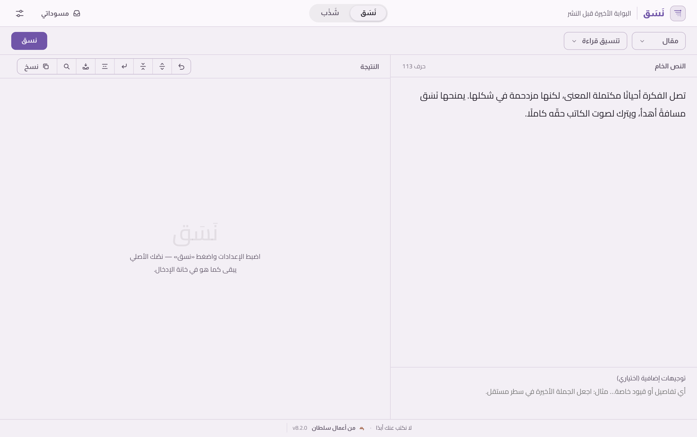
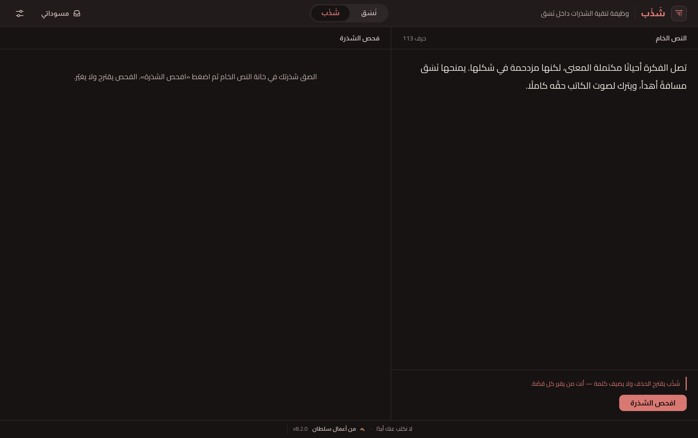

<div align="center">

<picture>
  <source media="(prefers-color-scheme: dark)" srcset="src-tauri/icons/dock/nasaq-dark.png">
  
</picture>

# نَسَق

### البوابة الأخيرة قبل النشر

تطبيق مكتبي عربيّ يرتّب النصوص ويجهّزها للقراءة والنشر —
يعالج الشكل والإيقاع، ولا يكتب عنك أبدًا.

<p>
  
  
  
  
</p>

</div>

## نظرة عامة

نَسَق أداة هادئة تقف بين نصّك وزرّ النشر. تأخذ ما كتبته وتعيده إليك مرتّبًا: الفقرات، والمسافات، وكسر الأسطر، والأسطر المفردة، وإيقاع القراءة — دون أن تلمس كلماتك أو تبدّل صوتك.

عهدٌ واحد يحكم التطبيق كلّه: **لا نكتب عنك أبدًا.**

النص الجيّد قد يصل مكتظًّا: جُمَل متلاصقة، وفقرات بلا نَفَس، وسطور طويلة تُتعب العين على الشاشة. المعنى موجود، لكن الشكل يخذله. يعالج نَسَق هذا الشكل وحده: يمنح النص مساحته، ويكشف إيقاعه، ويُريك كيف سيبدو للقارئ قبل أن تنشره — من غير أن يعيد صياغته.

<div align="center">

<picture>
  <source media="(prefers-color-scheme: dark)" srcset="assets/readme/nasaq-dark.png">
  
</picture>

<sub>النص الخام يمينًا، والنتيجة يسارًا — تتبع الواجهة مظهر نظامك نهارًا وليلًا.</sub>

</div>

## نَسَق — التنسيق

تختار النمط والمستوى، فيتكفّل نَسَق بالباقي: أين يبدأ السطر، ومتى يتنفّس النص بفراغ، وكيف تتوزّع الوقفات — ليصل النص إلى القارئ كما تسمعه أنت في رأسك.

- **خمسة أنماط للنص** — مقال، منشور، شذرة، رسالة، مخطط.
- **مستويات تدخّل متدرّجة** — من «تنظيف فقط» (محلي بالكامل، بلا اتصال) إلى تنسيق القراءة، فالتنسيق الإيقاعي، فتجهيز النص للنشر.
- **تنسيق حسب المنصة** — سابستاك (مقالًا ونوتًا)، وإكس، وثريدز، وإنستغرام، وواتساب؛ مع تنبيهٍ لحدود الأحرف حيث تفرضها المنصّة.
- **أدوات ضبط محلية على النتيجة** — سطور أكثر أو أقل، وفصل الجُمَل، وحذف الأسطر الفارغة، وتراجع حتى عشرين خطوة.
- **بصمة الإيقاع** — وصف محايد لتنفّس النص بعد التنسيق الإيقاعي.
- **تنويعات** — ثلاث صيغ تختلف في مواضع كسر السطر لوجهة سابستاك، تختار أنقاها.
- **عدسة القراءة** — معاينة نصّك بعرض شاشة هاتف، لترى كيف تتكسّر أسطره فعلًا قبل النشر (للعرض فقط، لا تحرير).
- **مسودات محلية** — تحفظ النص الأصلي والنتيجة معًا على جهازك، مع بحثٍ ونسخةٍ احتياطية (دمجًا لا استبدالًا).

## شَذْب — التهذيب بالحذف

إلى جانب التنسيق، يضمّ نَسَق وظيفة **شَذْب**: أداةٌ لضغط النصوص القصيرة وتهذيبها بالحذف. تفحص الشذرة، وتقترح قصّات حذفٍ — اقتباساتٍ حرفيةً من نصّك — تقبل كلًّا منها أو ترفضها، ويشهد تحقّقٌ آليّ أن لا كلمة أُضيفت.

<div align="center">



<sub>شَذْب يحذف ويُكثّف، ويحافظ على صوت النص كما هو.</sub>

</div>

شَذْب ليس محرّرًا أدبيًّا، ولا يضيف من عنده شيئًا. **نَسَق هو المنتج الأساسي، وشَذْب وظيفةٌ مساعدة داخله** — لكلٍّ لوحته وهويته (نَسَق بنفسجيّ، شَذْب طوبيّ)، دون خلطٍ بينهما.

## المبادئ

عهد نَسَق يرسم حدوده بوضوح:

- **لا يكتب النص بدلًا عنك** — لا جُمَل من عنده، ولا أفكار مُضافة.
- **لا يغيّر صوت الكاتب** — الكلمات والمعنى كما تركتَهما.
- **لا يحاكم جودة نصّك** — لا درجات، ولا نصائح تحريرية.
- **لا يحوّل التنسيق إلى تحرير** — عمله شكل النص، لا مضمونه.

## الخصوصية

- **يعمل محليًا.** لا يُرسَل أيّ نصّ إلى أيّ خدمة إلّا عند ضغطك زرّ التنسيق أو الفحص صراحةً.
- **مستوى «تنظيف فقط» وأدوات الضبط المحلية** تعمل دون أيّ اتصال بالشبكة.
- **مسوّداتك وإعداداتك** تُحفظ على جهازك وحده، ولا تغادره.
- **مفتاح الخدمة** يُخزَّن محليًا في ملف إعدادات على جهازك، ولا يظهر في أيّ سجلّ أو رسالة.

## التثبيت

نزّل أحدث نسخة من **[صفحة الإصدارات](https://github.com/iSltanX/Nasq-Releases/releases/latest)** (‏`.dmg` لنظام macOS · Apple Silicon)، ثم اسحب `Nasaq.app` إلى مجلد التطبيقات.

## التطوير

يتطلّب البناء من المصدر [Node.js](https://nodejs.org) و[بيئة Rust ‏/ Tauri](https://tauri.app).

```sh
# تثبيت الاعتمادات
npm install

# التشغيل أثناء التطوير
npm run tauri dev

# تشغيل الاختبارات
npm test

# بناء نسخة قابلة للتثبيت (macOS)
npm run tauri build
```

بعد البناء تجد التطبيق والـ`.dmg` في `src-tauri/target/release/bundle/`.

## التحديثات

منذ الإصدار **v8.2.0**، يحمل نَسَق **تحديثًا تلقائيًّا داخل التطبيق** عبر مُحدِّث Tauri الرسمي: من «الإعدادات ← حول» اضغط «البحث عن تحديثات»، فإن توفّر إصدارٌ أحدث يمكنك تنزيله ومتابعة تقدّمه، ثم «تثبيت وإعادة التشغيل». تُوقَّع التحديثات بمفتاح نَسَق ويتحقّق التطبيق من التوقيع قبل التثبيت. تُوزَّع الإصدارات وبياناتها (`latest.json`) من [قناة الإصدارات العامة](https://github.com/iSltanX/Nasq-Releases/releases)، ويمكن دائمًا التنزيل اليدويّ منها.

## التقنيات

- **[Tauri](https://tauri.app) 2** — إطار تطبيق سطح المكتب.
- **Rust** — النواة الخلفية ومنطق التحقّق.
- **HTML ‏/ CSS ‏/ JavaScript** — الواجهة، دون أُطُر خارجية.
- **Almarai ‏/ Cairo** — خطّا الواجهة والمتن، محمّلان محليًا داخل التطبيق: Almarai للعناوين والأزرار والتأكيدات، وCairo للمتن والحقول والنصوص المساندة.

يفصل التطبيق معماريًّا بين وضع الويب المؤطَّر (framed) ووضعه المكتبي الأصلي (native)، ولا يخلط بينهما.

## حالة المشروع

خاصّ، وفي مرحلة تجربةٍ محدودة. الإصدار الحالي **v8.2.0** (macOS · Apple Silicon).

سجلّ الإصدارات الكامل في **[CHANGELOG.md](CHANGELOG.md)**.

---

<div align="center">

صُمّم وطُوّر بواسطة **سلطان**

<sub>Sultan — Design &amp; Development</sub>

<br><br>
<sub>نَسَق — لا نكتب عنك أبدًا.</sub>

</div>
